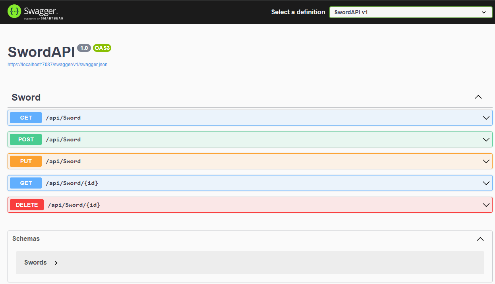
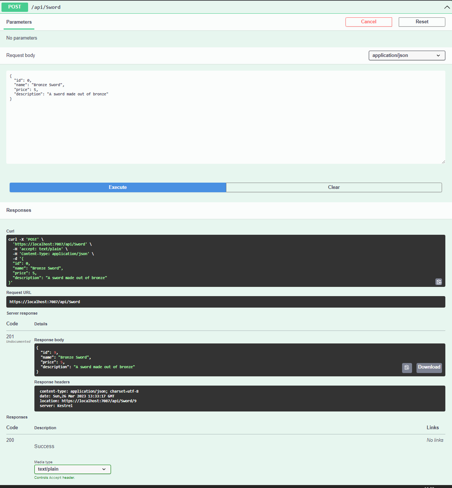
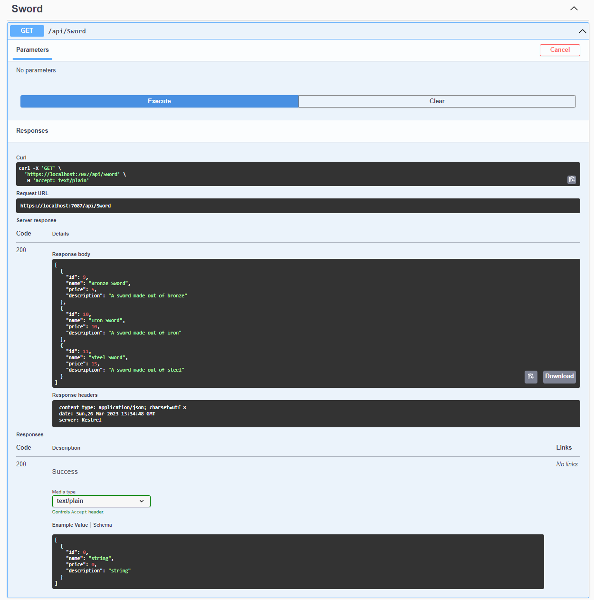
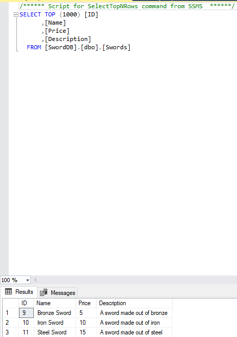
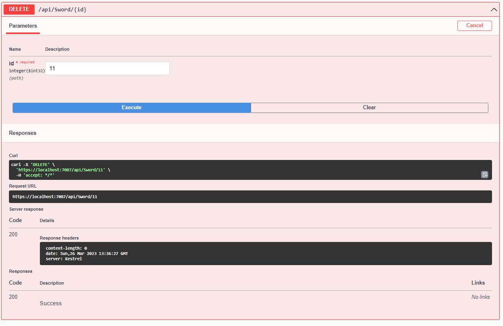
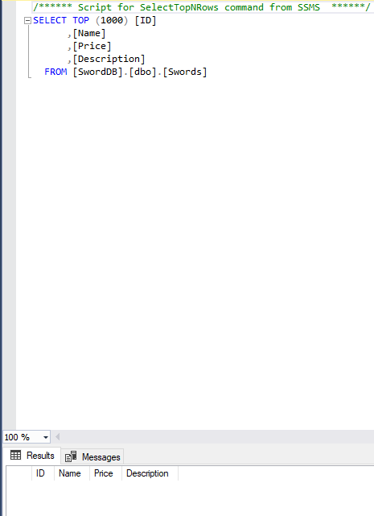

# Restful API for listing swords

SwordAPI is a simple RESTful API built in .Net. The main functionality of the API is to look at, edit, add and delete swords along with their other parameters into/from a Microsoft SQL database. Designed to work locally.

## Features:

Managing the types and prices of swords in the database.

## Database Used:

In this project, I used Microsoft SQL Server 2019 as the relational database.

## Technologies used:
- C#
- .NET
- Microsoft SQL Server 2019
- Visual Studio 2022

## Installation:
Install the following:
- [Visual Studio 2022](https://visualstudio.microsoft.com/vs/)
- [Microsoft SQL Server 2019](https://www.microsoft.com/en-in/sql-server/sql-server-downloads)

Do the following:
1. Create your database
2. Connect your database by replacing server=YOUR_DB with your own server's name in the "appsettings.json" file.
3. Run
4. You're all set!

Outputs:

